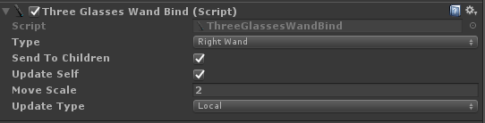

# 3GlassesSDK

**[Home Page](http://dev.vrshow.com/)** | **[中文手册](./README_zh.md)**

## How to Use

Select 3Glasses>EnableHeadDisplay from the main menu.


Make sure the EnableHeadDisplay is selected in the 3Glasses drop-down box.

Now the Three3GlassesManager script is bind in your main camera, and there are some Properties can control the HeadDisplay's behavior.


##### Option:

| Option:               | Discription                                                                            |
|-------------------------|----------------------------------------------------------------------------------------|
| Clone Target Camera     | The VR camera will clone the parameters of the specified camera (mandatory, not empty) |
| Bind Target Camera      | Bind the rotation and displacement of the camera to the main camera ( don't check to bind the rotation and displacement to the current GameObject) |
| FreezePosition          | freeze the headdisplay's position                                                      |
| FreezeRotation          | freeze the headdisplay's rotation                                                      |
| Hmd Anti Aliasing Level | RenderTexture's Anti Aliasing Level                                                    |
| Eye Distance            | The distance between the left and right camera in the HeadDisplay.                     |
| Layer Mask              | Includes or omits layers of objects to be rendered by the HeadDisplay device           |
| Enable JoyPad           | Enable the 3Glasses Wand                                                               |

## Get HMD Info

- Get HMD's position and rotation

```csharp
  using ThreeGlasses;

  //...

  Vector3 pos = TGInput.GetPosition(InputType.HMD);
  Quaternion rotate = TGInput.GetRotation(InputType.HMD);
```

- Get HMD's button, touchpad, proximity sensor info

```csharp
  // if the HMD's Menu Button is pressed
  TGInput.GetKey(InputType.HMD, InputKey.HmdMenu);

  // get touchpad info，rang is [-1.0~1.0]
  Vector2 v = TGInput.GetHMDTouchPad();

  // get proximity sensor state, where wearing HMD return true
  bool present = ThreeGlassesManager.GetHMDPresent();
```

## Get Wand Input

There are two ways to get wand's info:

### Get

The InputExtendMethods class definit some methods for get the wand's info. you can get the info like this:

```csharp
  using ThreeGlasses;

  //...

  // get the back key status (down is true)
  TGInput.GetKey(InputType.LeftWand, InputKey.WandBack);

  // get the stick's info,Both the X axis and the Y axis are limited to between -1 and 1.
  Vector2 v = TGInput.GetStick(InputType.LeftWand);
```

### Bind Script

Bind the ThreeGlassesWandBind.cs on your wand object.



##### Option:

| Option           | Description                      |
|------------------|----------------------------------|
| Type             | wand's type                      |
| Send To Children | send wand's info to all children |
| Update Self      | update the position and rotation |
| Move Scale       | scale wand's position            |
| Update Type      | update local or world            |

The children of the object who bind the ThreeGlassesWandBind.cs can implement OnWandChange for get the wand's info.

```csharp
  void OnWandChange(ThreeGlassesWand.Wand pack)
  {
      // do somethng
      // pack.position or rotation
      // pack.GetKey(InputKey.xxx);
  }
```

#### Quality Settings


#### Player Setting


#### Single Pass supported


