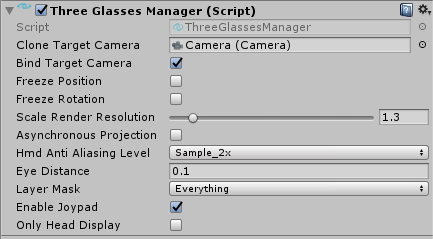

# 3GlassesSDK

**[开发者主页](http://dev.vrshow.com/)** | **[English Manual](./README.md)**

## 接入SDK

- 如果之前有安装过3Glasses的SDK，请先在项目中删除干净。
- 导入release的unity包，或直接将Assets/ThreeGlasses拷贝到自己项目的Assests文件夹下。
- 这时可以在menu菜单中看到3Glasses的menu，如果没有重复以上步骤。
- 从menu菜单中选择 3Glasses>EnableHeadDisplay


确保EnableHeadDisplay菜单选项已被勾选。

- 现在Three3GlassesManager脚本已经绑定到你的主相机上了。



##### 选项:

| 选项                    | 描述                                                                    |
| :---------------------- | :--------------------------------------------------------------------- |
| Clone Target Camera     | VR相机将克隆指定相机的参数(必选,不能为空)                                 |
| Bind Target Camera      | 将相机的旋转和位移绑定到主相机上(不勾选则将旋转和位移绑定到当前GameObject上) |
| Freeze Position         | 头盔的位置变动不会更新                                                   |
| Freeze Rotation         | 头盔的旋转变动不会更新                                                   |
| Hmd Anti Aliasing Level | 渲染的抗锯齿级别                                                        |
| Eye Distance            | 头显内部左右相机的距离                                                   |
| Layer Mask              | 头显可以看到的层                                                        |
| Enable JoyPad           | 使用3Glasses的Wand手柄                                                 |

## 使用SDK脚本

### 获取头显的位置和旋转信息

```csharp
  using ThreeGlasses;

  //...

  Vector3 pos = TGInput.GetPosition(InputType.HMD);
  Quaternion rotate = TGInput.GetRotation(InputType.HMD);
```

### 获取头显的按键和TouchPad信息

```csharp
  // 这里获取头显的menu按键是否有按下
  TGInput.GetKey(InputType.HMD, InputKey.HmdMenu);

  // 获取touchpad信息，范围是 [-1.0~1.0]
  Vector2 v = TGInput.GetHMDTouchPad();
```

### 获取Wand手柄的输入

  有两种方法获取手柄信息:

#### 1. 直接Get的方式

InputExtendMethods类定义了一些获取手柄信息的方法，如下：

```csharp
  using ThreeGlasses;

  //...

  // 这里是获取wand手柄上back按键的状态 (按键按下返回true)
  TGInput.GetKey(InputType.LeftWand, InputKey.WandBack);
  // 返回遥感的x,y值，这两个值都在-1--1之间
  Vector2 v = TGInput.GetStick(InputType.LeftWand);
```

#### 2. 绑定脚本方式

将ThreeGlassesWandBind.cs脚本绑定到GameObject上。


##### 选项:

| 选项             | 描述                             |
| :--------------- | :------------------------------ |
| Type             | 手柄类型                         |
| Send To Children | 是否将获取的手柄信息传递给子对象   |
| Update Self      | 是否更新自己的位置和旋转          |
| Move Scale       | 手柄移动的放大系数               |
| Update Type      | 更新本地坐标还是世界坐标          |


手柄对象的子对象只要实现OnWandChange方法就可以获取手柄的详细信息了。

```csharp
  void OnWandChange(ThreeGlassesWand.Wand pack)
  {
      // do somethng
      // pack.position or rotation
      // pack.GetKey(InputKey.xxx);
  }
```
